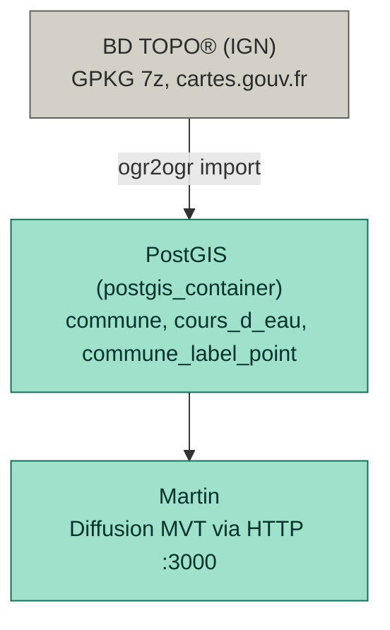
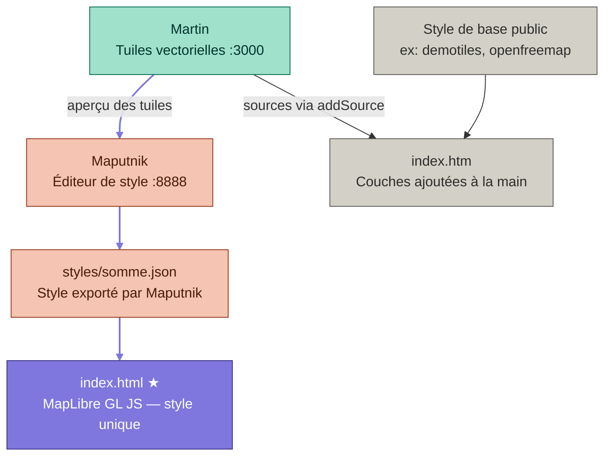

# Architecture — somme-gis

## Pipeline de données

## Points d'entrée front

`index.html` charge un style unique généré par Maputnik. `index.htm` assemble ses couches à la main en JavaScript directement depuis Martin, sans passer par Maputnik.

**Chaîne violette** = point d'entrée privilégié (`index.html`), qui passe par le style JSON exporté depuis Maputnik.
